# Table of Contents
* [Introduction](#introudction)
* [Guardrails](#guardrails)
  * [What are LLM Guardrails?](#what-are-llm-guardrails)
    * [LLM Guardrails Requirements](#llm-guardrail-requirements)
      * [Functional](#functinal)
      * [Non-Functional](#non-functinal)
    * [Designing Guardrails](#designing-guardrails)
  * [LLM Inference using Safeguards](#llm-inference-using-safeguards)
  * [Building Safeguards](#building-safeguards)
  * [Synthetic Data Generation](#synthetic-data-generation)
* [References](#references)

# Introduction

  <figure>
  
  <figcaption><em>Cerberus, the three-headed guardian of the underworld's gates</em></figcaption>
  </figure>

Picture this: you're working at OpenAI and just launched ChatGPT around late 2022. Everyone is jumping to use this new frontier of AI that seems to be one big step towards AGI. Users are amazed by the model's capabilities—it can write poetry, debug code, explain complex concepts, and engage in thoughtful conversation. 

**But then reality hits: when you give users the opportunity to ask anything, they will ASK ANYTHING.**

Within days, social media explodes with screenshots of users who have found creative ways to circumvent the model's safety guidelines. They're sharing "" prompts that trick the AI into roleplaying as unrestricted chatbots, providing inappropriate content, or bypassing ethical constraints through clever prompt engineering.

<figure>
  
  <figcaption><em>Screenshot of conversation with ChatGPT attempting to provide nuclear weapons information</em></figcaption>
</figure>

What started as an exciting product launch quickly becomes a high-stakes game of digital whack-a-mole—every safety patch seems to spawn three new attack vectors. Users will always probe the boundaries, test the limits, and find creative ways to extract unintended behaviors. Some are driven by curiosity, others by malicious intent, but the result is the same: **without robust safeguards, even the most carefully trained models become vulnerable to adversarial manipulation.**

Even those who self-host their own LLM can't run away from this, as moving from a LLM Provider API such as OpenAI, Anthropic, etc. you don't just use their model's, you use the **entire system** they built as a whole which has their own set of safeguards in place. 

Below is an image of my own prompt injection done on the chatbot from the National AI Office(NAIO) of Malaysia's Bot which is powered by [Nous](https://nous.my/).

<figure>
  
  <figcaption><em>Prompt Injection on The National AI Office(NAIO) of Malaysia's Bot</em></figcaption>
</figure>

Anthropic for example, has an entire team dedicated to this issue called **Safeguards** which they are aggressively hiring for:

Diving into the Machine Learning Engineer job description you can see the following tasks which do talk about building ML models to detect unwanted behaviors. 

This is why every production LLM deployment needs its own **Cerberus** — a multi-layered defense system that stands guard before prompts ever reach your frontier model.
> NOTE: Guardrails apply to inputs and outputs as detailed in the next section but our main focus will be on input guardrails.

# Safeguards

## What Are LLM Safeguards?

> Safeguards and Guardrails are used interchangeably

Think of safeguards/guardrails as your LLM's personal security team—they're the difference between leaving your front door wide open and having actual protection in place.

**Without guardrails**, you're running a completely exposed system. User input hits your LLM directly, whatever comes out goes straight back to the user, and you're basically crossing your fingers that nothing goes wrong. 

> *Spoiler alert: something will go wrong*.

**With guardrails**, you get two layers of protection that actually matter:

1. **Input Guards** are your first line of defense—they scan every prompt before it gets anywhere near your expensive frontier model. They're looking for the stuff that'll ruin your day: PII that could get you sued, off-topic garbage that wastes compute, and those clever jailbreak attempts that think they're smarter than your safety measures.

2. **Output Guards** catch the problems your LLM creates. Even the best models hallucinate, generate inappropriate content, or accidentally mention your competitors. Output guards are there to make sure those mistakes never see daylight.

## LLM Safeguards Requirements

### Functional

These are the core jobs your guardrails need to handle:

- **Input Filtering** - Block problematic content before it reaches your LLM. This includes jailbreak attempts, PII that creates compliance issues, and off-topic requests that waste resources.

- **Output Validation** - Check LLM responses before users see them. Models can hallucinate, generate inappropriate content, or mention competitors when they shouldn't.

- **Content Moderation** - Enforce your business rules and brand guidelines automatically. If your support bot starts giving legal advice, that's a problem.

- **Format Checking** - For structured outputs like JSON, ensure the response is actually parseable. Malformed responses break downstream systems.

- **Threat Detection** - Identify prompt injections, conversation hijacking, and policy violations in real-time.

### Non-Functional

- **Latency** - Guardrails add processing time. Users expect fast responses, so you need to run checks efficiently, often in parallel with your main LLM call.

- **Accuracy** - Balance false positives (blocking good requests) with false negatives (missing actual threats). This requires proper evaluation and threshold tuning.

- **Cost** - Each guardrail adds computational overhead. You need to optimize between expensive models that are accurate and cheaper models that are fast enough.

- **Scale** - Your guardrails must handle production traffic without becoming bottlenecks. This means efficient architecture and resource management.

- **Maintainability** - Threats evolve constantly. Your system needs to be easily updated as new attack patterns emerge.

## LLM Inference using Safeguards

<figure>
  
  <figcaption><em>LLM Inference Workflow</em></figcaption>
</figure>

When you type a prompt into the ChatGPT web UI and hit “Send,” your text is sent to the inference server. The server breaks your input into tokens, turns each token into a numeric embedding, and runs those embeddings through a stack of transformer layers to build a contextual representation. At each step, it computes scores (logits) for every possible next token, picks one based on those scores, appends it to the output, and repeats until a stop token is produced. Finally, the completed response is sent back to the UI and displayed on your screen.

<figure>
  
  <figcaption><em>LLM Safeguards in Inference</em></figcaption>
</figure>

With LLM Safeguards you would be having a separate service to determine beforehand whether the input prompt is safe or unsafe. From there the simplest approach would be to return a placeholder **"Sorry I am unable to answer that question!"**. More advanced systems could even send the response to a smaller and faster LLM in order to return a more personalized response.

<figure>
  
  <figcaption><em>Safeguards blocking messages in ChatGPT</em></figcaption>
</figure>

## Building Safeguards

<figure>
  
  <figcaption><em>Safeguards Tradeoff Chart</em></figcaption>
</figure>

In a general sense, the three techniques we have for building safeguards can be broken down into the following characteristics:

| Technique | Speed/Cost | Accuracy | Description | Use Case |
|-----------|------------|----------|-------------|----------|
| **Heuristics** | Fast/Cheap | Low | Rule-based classification using keywords, patterns, or regex. Simple if-then logic for safety detection. | Quick prototyping, baseline systems, or when computational resources are extremely limited |
| **Small ML Models** | Fast/Cheap | High | Lightweight, specialized models (e.g., DistilBERT, small classifiers) trained specifically for safety classification | Production systems, large-scale synthetic data generation, real-time applications |
| **LLM-as-a-Guardrail** | Slow/Expensive | High | Large language models (GPT-4, Claude, etc.) used to evaluate and classify prompt safety with nuanced understanding | High-stakes decisions, complex edge cases, quality validation of synthetic datasets |

Before we can build and evaluate these safeguards, we need ground truth data—a collection of prompts labeled as either safe or unsafe. However, obtaining high-quality safety datasets poses several challenges: they often contain sensitive content, require careful human annotation, and must cover diverse edge cases. 

To address this challenge, we'll leverage LLMs themselves to generate our training data. This process, known as [Synthetic Data Generation](https://aws.amazon.com/what-is/synthetic-data/), allows us to create large-scale, diverse datasets with accurate safety labels while maintaining control over the distribution and complexity of examples.

## Synthetic Data Generation

### How Synthetic Data Generation Works

Synthetic data generation leverages large language models to create realistic, labeled datasets for training safety classifiers. This approach offers a powerful solution to commonly faced problems: the availability of high-quality, diverse, and privacy-compliant data.

### The Challenge: Imbalanced Safety Data

In real-world scenarios, safety classification data is naturally imbalanced—typically 90-95% of prompts are safe, while only a small percentage contain harmful content. This imbalance creates critical challenges:

- **Model Bias**: Classifiers tend to over-predict the majority class (safe)
- **Poor Recall**: Models may miss many unsafe prompts, creating safety risks
- **Limited Edge Cases**: Rare but critical safety violations are underrepresented

## The Cerberus Synthetic Data Generation Process

### Implementation Details:

```mermaid
flowchart TB
    A["v2_safe_contexts.txt<br>Safe Prompt Templates"] --> C["LLM Generation Engine<br>GPT-4/Claude"]
    B["v2_unsafe_contexts.txt<br>Unsafe Prompt Templates"] --> C
    C --> D["Generate 1,000 Examples<br>per Category"]
    D --> E["90% Safe Examples<br>~900 samples"] & F["10% Unsafe Examples<br>~100 samples"]
    E --> G["Combined Raw Dataset<br>Labels: safe/unsafe"]
    F --> G
    G --> H["SemHash Deduplication<br>deduplicate.py"]
    H --> I["Remove Semantically<br>Similar Examples"]
    I --> J["Deduplicated Dataset"]
    J --> K["G-Eval Validation<br>evaluate.py"]
    K --> L["Secondary LLM<br>Label Verification"]
    L --> M{"LLM Agrees<br>with Label?"}
    M -- Yes --> N["Validated Examples<br>Keep Original Label"]
    M -- No --> O["Flagged Examples<br>Need Human Review"]
    O --> P["Argilla Platform<br>annotate.py"]
    P --> Q["Human Annotators<br>~20 examples reviewed"]
    Q --> R["Corrected Labels"]
    N --> S["Dataset Assembly"]
    R --> S
    S --> U["Final Synthetic Dataset<br>Hugging Face Datasets"]
    
    V["Safe Categories (90%):<br>• Web Development & APIs<br>• Mobile Development<br>• Cloud & DevOps<br>• Databases<br>• Distributed Systems<br>• Game Development<br>• Data Engineering<br>• Embedded Systems<br>• Blockchain<br>• Scientific Computing"] -. Informs .-> A
    
    W["Unsafe Categories (10%):<br>• Network Exploitation<br>• Web App Attacks<br>• Malware Development<br>• Social Engineering<br>• Cryptographic Attacks<br>• Mobile Exploitation<br>• Cloud Infrastructure Attacks<br>• IoT/ICS Attacks<br>• Advanced Persistence<br>• Data Exfiltration"] -. Informs .-> B
    
    A:::inputStyle
    C:::processStyle
    B:::inputStyle
    D:::processStyle
    E:::processStyle
    F:::processStyle
    G:::processStyle
    H:::validationStyle
    I:::validationStyle
    J:::processStyle
    K:::validationStyle
    L:::validationStyle
    M:::decisionStyle
    N:::processStyle
    O:::humanStyle
    P:::humanStyle
    Q:::humanStyle
    R:::humanStyle
    S:::processStyle
    U:::outputStyle
    V:::inputStyle
    W:::inputStyle
    
    classDef inputStyle fill:#e1f5fe,stroke:#01579b,stroke-width:2px,color:#000
    classDef processStyle fill:#fff3e0,stroke:#e65100,stroke-width:2px,color:#000
    classDef validationStyle fill:#f3e5f5,stroke:#4a148c,stroke-width:2px,color:#000
    classDef humanStyle fill:#fce4ec,stroke:#880e4f,stroke-width:2px,color:#000
    classDef outputStyle fill:#e8f5e9,stroke:#1b5e20,stroke-width:2px,color:#000
    classDef decisionStyle fill:#fff9c4,stroke:#f57f17,stroke-width:2px,color:#000 
```

1. **Prompt Template Design**
   - Created separate prompt templates for safe contexts (`v2_safe_contexts.txt`) and unsafe contexts (`v2_unsafe_contexts.txt`)
   - Each template covers different safety categories and edge cases
   - Templates designed to generate realistic, contextually appropriate examples

2. **Controlled Generation**
   - Generated 1,000 examples per category
   - Maintained 90/10 split (safe/unsafe) to reflect real-world distribution
   - This realistic ratio prevents the model from becoming overly sensitive

3. **Semantic Deduplication**
   - Implemented SemHash deduplication (`deduplicate.py`) to remove semantically similar examples
   - Ensures diversity in the training data
   - Prevents model overfitting on repeated patterns

4. **G-Eval Quality Validation**
   - Used a second LLM to evaluate each generated example (`evaluate.py`)
   - The evaluator LLM independently assessed whether it agreed with the assigned label
   - This cross-validation catches potential mislabeling from the generation phase

5. **Human-in-the-Loop Annotation**
   - When G-Eval disagreed with original labels, flagged examples for human review
   - Used Argilla for efficient annotation workflow (`annotate.py`)
   - Hand-annotated approximately 20 examples where LLM validation showed disagreement
   - Human judgment served as the final arbiter for edge cases

6. **Dataset Finalization**
   - Combined original labels with human annotations
   - Exported final dataset to Hugging Face Datasets for easy distribution
   - Maintained full provenance of label sources (generated vs. human-annotated)

# References
- [Guardrails AI](https://www.guardrailsai.com/docs)
- [How to use Guardrails from OpenAI](https://cookbook.openai.com/examples/how_to_use_guardrails)
- [What is Synthetic Data?](https://aws.amazon.com/what-is/synthetic-data/)
